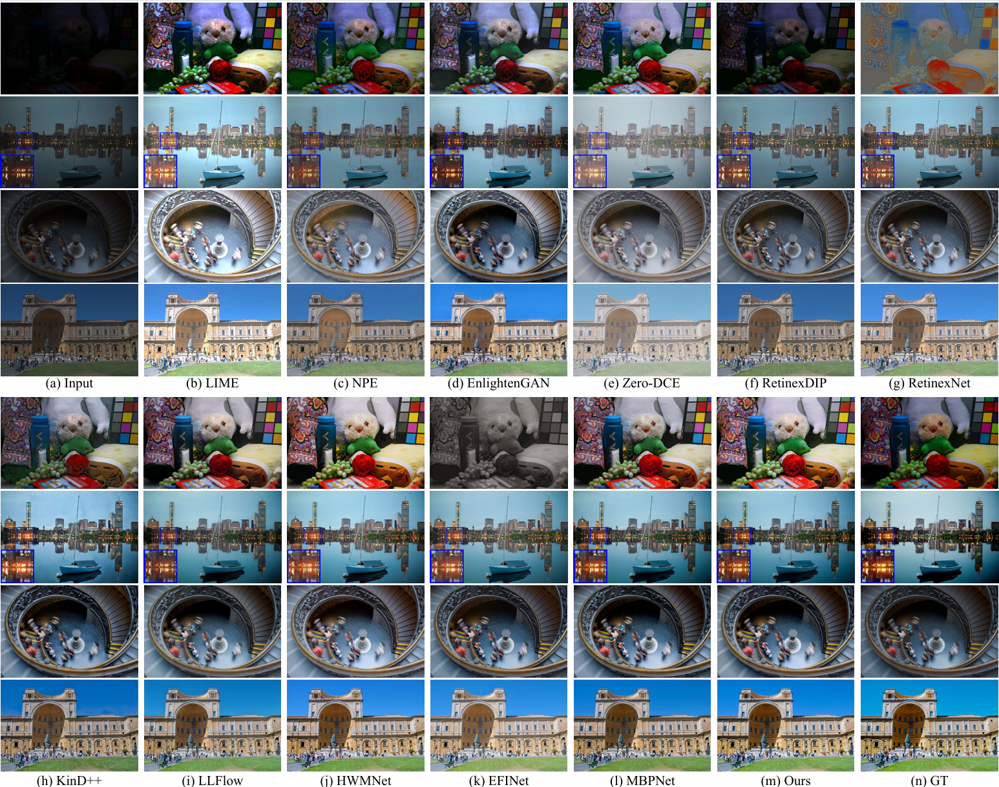

# Low-Light Image Enhancement With Multi-Scale Attention and Frequency-Domain Optimization

The official pytorch implementation of the paper **[Low-Light Image Enhancement With Multi-Scale Attention and Frequency-Domain Optimization (TCSVT 2024)](https://ieeexplore.ieee.org/document/10244055)**

>    **Abstract**: Low-light image enhancement aims to improve the perceptual quality of images captured in conditions of insufficient illumination. However, such images are often characterized by low visibility and noise, making the task challenging. Recently, significant progress has been made using deep learning-based approaches. Nonetheless, existing methods encounter difficulties in balancing global and local illumination enhancement and may fail to suppress noise in complex lighting conditions. To address these issues, we first propose a multi-scale illumination adjustment network to balance both global illumination and local contrast. Furthermore, to effectively suppress noise potentially amplified by the illumination adjustment, we introduce a wavelet-based attention network that efficiently perceives and removes noise in the frequency domain. We additionally incorporate a discrete wavelet transform loss to supervise the training process. Particularly, the proposed wavelet-based attention network has been shown to enhance the performance of existing low-light image enhancement methods. This observation indicates that the proposed wavelet-based attention network can be flexibly adapted to current approaches to yield superior enhancement results. Furthermore, extensive experiments conducted on benchmark datasets and downstream object detection task demonstrate that our proposed method achieves state-of-the-art performance and generalization ability.

## Architecture


## Results and Pre-trained models

**Related material can be found [here](https://drive.google.com/drive/folders/1rN8AW0mQNgKBhHtqcLV72Vq43k3YjzdZ?usp=sharing)**



We provide the pre-trained models and visual results.

| Dataset         | PSNR  | SSIM   | MAC(s) | Pre-trained Model                                                                                   | Visual Results                                                                                        |
|-----------------|-------|--------|--------|-----------------------------------------------------------------------------------------------------|-------------------------------------------------------------------------------------------------------|
| LOL             | 29.35 | 0.7877 | 0.19   | [LOL ckpt](https://drive.google.com/drive/folders/1Y4uat21f_epS-Y4JNUt2a7susHSeSfBg?usp=drive_link) | [LOL images](https://drive.google.com/drive/folders/1Tp6W8klAkXXG4he5JsdKrcoItGmGRSrN?usp=drive_link) |
| MIT-Adobe FiveK | 27.55 | 0.7118 | 0.23   | [MIT ckpt](https://drive.google.com/drive/folders/1bFb2TDm24emWYMzvAxz4dVEu8l1YyEYf?usp=drive_link) | [MIT images](https://drive.google.com/drive/folders/1pCSauaVhdBqFDO_qHqtZNaUi2xNcN0_g?usp=drive_link) |


The pre-trained models are organized as below:

```bash
pretrained_model/
├── lol
│   ├── stage1.pth
│   └── stage2.pth
└── mit
    ├── stage1.pth
    └── stage2.pth
```


## Requirements

```bash
python=3.8
pytorch=1.8.0 
cudatoolkit=11.1.1
torchvision=0.9.0
```

Details can be found in [pytorch180.yaml](./pytorch180.yaml)


## Datasets

- Low-light dataset: [LOL](https://daooshee.github.io/BMVC2018website/)
- MIT-Adobe FiveK dataset: [MIT](https://drive.google.com/drive/folders/144GTFl8SLygM_yWfNnzkk-RWSXu4eypt?usp=sharing)

```shell
datasets/
├── LOL
│   ├── eval15
│   │   ├── high
│   │   │   ├── 111.png
│   │   │   └── ...
│   │   └── low
│   │       ├── 111.png
│   │       └── ...
│   └── our485
│       ├── high
│       │   ├── 100.png
│       │   └── ...
│       └── low
│           ├── 100.png
│           └── ...
└── MIT_Adobe_fivek_split
    ├── test
    │   ├── high
    │   └── low
    └── train
        ├── high
        └── low
```


## Training

To train new models from scratch:

### Overall procedure

1. Initially, train the network for the first stage independently. 
2. Subsequently, utilize the acquired weights to generate enhanced results via `test.py`. These enhanced outcomes are then employed as inputs for the second stage, followed by separate training of the network for the second stage.


### Train first stage

1. Set the directories for training, testing, and saving the model in the `model/stage1/training.yaml` file.

```yaml
TRAIN_DIR: '/{dataset_path}/datasets/LOL/our485'
TEST_DIR: '/{dataset_path}/datasets/LOL/eval15'
SAVE_DIR: '/{project_path}/checkpoints'
```

2. Run the code

```shell
cd model/stage1
python train_MIANet.py
```


### Train second stage

1. The enhanced image is obtained using the first-stage network and used as input to the second-stage network.

The second stage input is organized as below:

```shell
stage1/
└── LOL
    ├── eval15
    │   ├── high # GT
    │   └── low # generate by MIANet
    └── our485
        ├── high # GT
        └── low # generate by MIANet
```

generate the input of the second stage, which is the output of the first stage
```bash
# --model_type=1 means using MIANet
python test.py --model_type=1 --input_dir=datasets/LOL/eval15/low --output_dir=datasets/stage1/LOL/eval15/low --weights_1=pretrained_model/lol/stage1.pth
python test.py --model_type=1 --input_dir=datasets/LOL/our485/low --output_dir=datasets/stage1/LOL/our485/low --weights_1=pretrained_model/lol/stage1.pth

# move the GT
cp -r datasets/LOL/eval15/high  datasets/stage1/LOL/eval15/high
cp -r datasets/LOL/our485/high  datasets/stage1/LOL/our485/high
```


2. Set the directories for training, testing, and saving the model in the `model/stage2/training.yaml` file.

```yaml
TRAIN_DIR: '/{dataset_path}/datasets/stage1/LOL/our485'
TEST_DIR: '/{dataset_path}/datasets/stage1/LOL/eval15'
SAVE_DIR: '/{project_path}/checkpoints'
```


3. Run the code

```shell
cd model/stage2
python train_WNENet.py
```


## Evaluation

To evaluate trained models:

**LOL**

```shell
python test.py --input_dir=datasets/LOL/eval15/low --output_dir=output/lol/ --high_dir=datasets/LOL/eval15/high --weights_1=pretrained_model/lol/stage1.pth --weights_2=pretrained_model/lol/stage2.pth
```


**MIT**

```shell
python test.py --input_dir=datasets/MIT_Adobe_fivek_split/test/low --output_dir=output/mit/ --high_dir=datasets/MIT_Adobe_fivek_split/test/high --weights_1=pretrained_model/mit/stage1.pth --weights_2=pretrained_model/mit/stage2.pth
```


## Citation

If SWANet helps your research or work, please consider citing this paper.

```
@ARTICLE{10244055,
  author={He, Zhiquan and Ran, Wu and Liu, Shulin and Li, Kehua and Lu, Jiawen and Xie, Changyong and Liu, Yong and Lu, Hong},
  journal={IEEE Transactions on Circuits and Systems for Video Technology}, 
  title={Low-Light Image Enhancement With Multi-Scale Attention and Frequency-Domain Optimization}, 
  year={2024},
  volume={34},
  number={4},
  pages={2861-2875}
}
```


## Contact

If you have any questions, please contact [zqhe22@m.fudan.edu.cn](zqhe22@m.fudan.edu.cn).